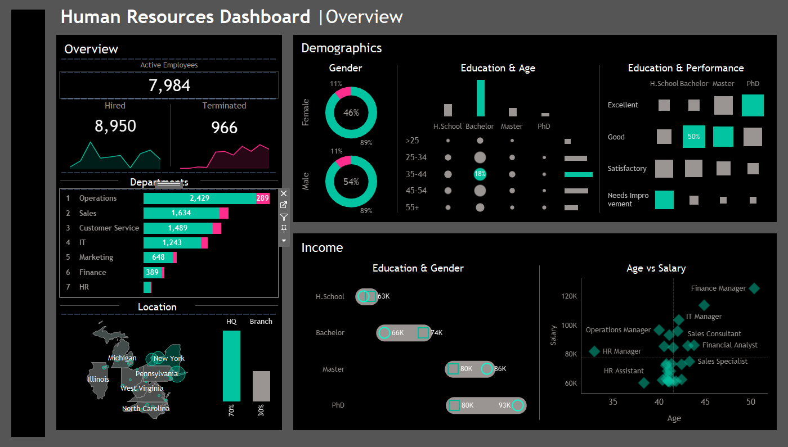

# 👩‍💼 Human Resources Dashboard – Tableau

An interactive **HR Analytics Dashboard** built in **Tableau**, offering clear insights into workforce demographics, performance, department-level analysis, and salary trends.

---

## 🖼️ Dashboard Preview

---

## 🔍 Overview

This dashboard answers key HR questions like:
- How many employees are hired vs terminated?
- What's the gender and education distribution?
- Which departments have the highest activity?
- How does education level relate to performance?
- What are the salary trends by age and job role?

---

## 💡 Key Features

- 📊 **Employee Overview**: Active, hired, and terminated employee stats
- 🧑‍🤝‍🧑 **Demographics**: Gender, education, and age breakdowns
- 📈 **Department Insights**: Hires and terminations per department
- 🗺️ **Geographic View**: Employee distribution across U.S. states
- 💵 **Income Analysis**: Salary comparisons by education and gender
- 🧠 **Performance Metrics**: Education vs performance rating grid
- 📉 **Age vs Salary Scatter Plot**: Compare roles by pay and age

---

## 🛠 Tools Used

- **Tableau Desktop**
- Calculated fields & filters
- Dashboard actions & interactivity
- Clean dark theme for enhanced readability

---

## 🚀 How to Use

1. Download the `.twbx` file from this repository
2. Open it with **Tableau Desktop** or **Tableau Public**
3. Interact with filters and visuals to explore the HR insights

---

## 📁 Files in This Repo

- `dashboard.twbx` – Main Tableau workbook
- `hrdashboard.png` – Screenshot of the dashboard (preview)

---

## 🙋‍♀️ Author

**Aaditi**  
🔗 GitHub: [aaditi43](https://github.com/aaditi43)

---

## 💬 Feedback or Questions?

Feel free to open an issue or start a discussion!
